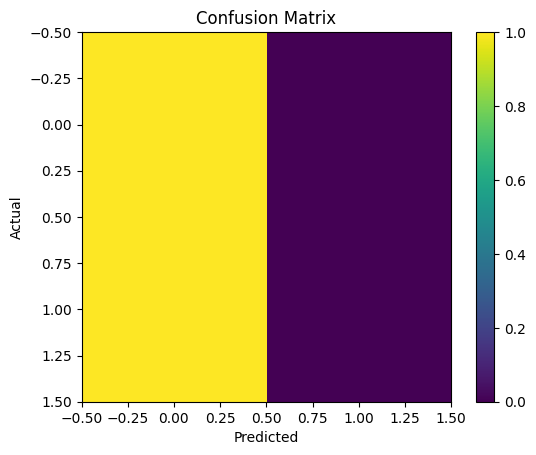

# Task 2: Sentiment Analysis using Machine Learning

## Introduction

This project focuses on Sentiment Analysis, which is a Natural Language Processing (NLP) technique used to determine whether a piece of text expresses a positive or negative sentiment. It is widely used in applications like product reviews, social media analysis, and customer feedback systems.

## Objective

The objective of this project is to build a machine learning model that can classify text data into two categories:

* Positive Sentiment
* Negative Sentiment

## Dataset

A small sample dataset was created containing text sentences labeled as either positive (1) or negative (0). The dataset includes examples such as:

* "I love this product" (Positive)
* "This is bad" (Negative)

## Methodology

The following steps were performed:

1. Imported required libraries such as pandas, sklearn, and matplotlib.
2. Created a dataset of text and corresponding sentiment labels.
3. Converted text data into numerical format using CountVectorizer.
4. Split the dataset into training and testing sets.
5. Trained a Naive Bayes (MultinomialNB) model on the training data.
6. Predicted sentiments for test data.
7. Evaluated the model using accuracy score.
8. Visualized the results using a confusion matrix.

## Model Explanation

The Multinomial Naive Bayes algorithm is commonly used for text classification. It works by calculating the probability of words appearing in each class and uses Bayes' theorem to predict the sentiment of new text.

## Results

The model produced an accuracy score and a confusion matrix that shows the performance of the classifier.

## Conclusion

This project demonstrates how machine learning can be applied to text data for sentiment classification. Even with a small dataset, the model is able to perform basic sentiment prediction effectively.

## Tools Used

* Python
* Scikit-learn
* Pandas
* Matplotlib
* Google Colab
